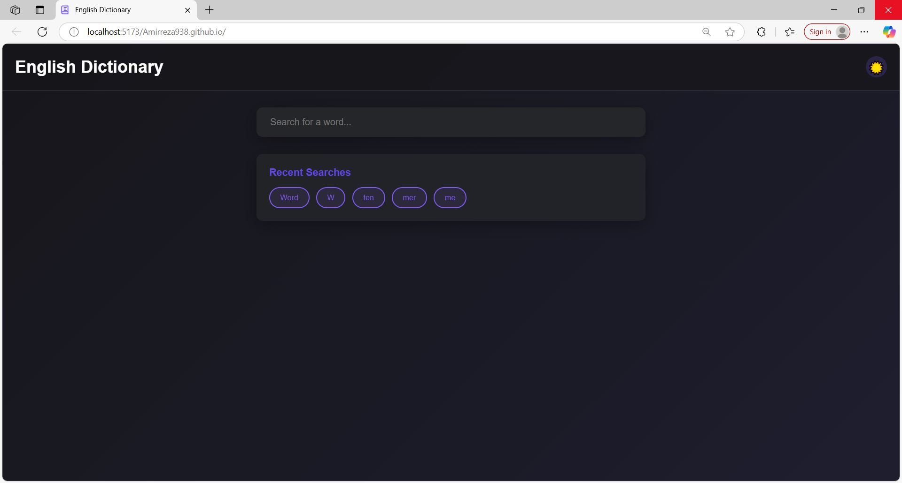

# Dictionary App

A modern English dictionary web application built with React that allows users to search for word definitions, pronunciations, and examples.



## Features

- Search for word definitions, etymologies, and usage examples
- Listen to word pronunciations
- View multiple meanings and examples for each word
- Responsive design works on desktop and mobile devices
- Dark/light mode toggle
- History of recent searches

## Technologies Used

- **React** - UI library
- **Vite** - Build tool and development server
- **Free Dictionary API** - Dictionary data source
- **CSS Modules** - Styling
- **GitHub Pages** - Hosting

## Installation

Follow these steps to set up the project locally:

```bash
# Clone the repository
git clone https://github.com/yourusername/dictionary-app.git

# Navigate to the project directory
cd dictionary-app

# Install dependencies
npm install

# Start the development server
npm run dev
```

The application will be available at `http://localhost:5173`

## Project Structure

```
dictionary-app/
├── public/
│   ├── dictionary-icon.svg
│   └── ...
├── src/
│   ├── components/
│   │   ├── Footer.jsx
│   │   └── ...
│   ├── App.jsx
│   ├── main.jsx
│   └── ...
├── index.html
└── README.md
```

## API Usage

This application uses the [Free Dictionary API](https://dictionaryapi.dev/) to fetch word definitions.

Example API usage:

```javascript
fetch('https://api.dictionaryapi.dev/api/v2/entries/en/hello')
  .then(response => response.json())
  .then(data => console.log(data))
```

## Browser Support

The Dictionary App supports all modern browsers including:

- Chrome (latest 2 versions)
- Firefox (latest 2 versions)
- Safari (latest 2 versions)
- Edge (latest 2 versions)

## Contributing

Contributions are welcome! Please feel free to submit a Pull Request.

1. Fork the repository
2. Create your feature branch (`git checkout -b feature/amazing-feature`)
3. Commit your changes (`git commit -m 'Add some amazing feature'`)
4. Push to the branch (`git push origin feature/amazing-feature`)
5. Open a Pull Request

## License

This project is licensed under the MIT License - see the [LICENSE](LICENSE) file for details.

## Acknowledgements

- [Free Dictionary API](https://dictionaryapi.dev/) for providing the dictionary data
- [Vite](https://vitejs.dev/) for the excellent development experience
- All the open-source libraries used in this project
